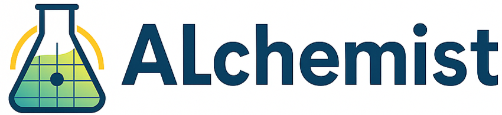

 { width="400" }

**ALchemist: Active Learning Toolkit for Chemical and Materials Research**

ALchemist is a modular Python toolkit that brings active learning and Bayesian optimization to experimental design in chemical and materials research. It is designed for scientists and engineers who want to efficiently explore or optimize high-dimensional variable spaces—without writing code—using an intuitive graphical interface.

---

## 📖 Documentation

Full user guide and documentation:  
[https://calebcoatney.github.io/ALchemist/](https://calebcoatney.github.io/ALchemist/)

---

## 🚀 Overview

ALchemist accelerates discovery and optimization by combining:

- **Flexible variable space definition:** Real, integer, and categorical variables with bounds or discrete values.
- **Probabilistic surrogate modeling:** Gaussian process regression via BoTorch or scikit-optimize backends.
- **Advanced acquisition strategies:** Efficient sampling using qEI, qPI, qUCB, and qNegIntegratedPosteriorVariance.
- **Intuitive GUI workflow:** No coding required—define variables, generate initial experiments, load data, train models, and suggest new experiments.
- **Experiment tracking:** CSV logging, reproducible random seeds, and error tracking.
- **Extensibility:** Abstract interfaces for models and acquisition functions enable future backend and workflow expansion.

---

## 🧭 Getting Started

Requirements: Python 3.9 or higher

We recommend using [Anaconda](https://www.anaconda.com/products/distribution) to manage your Python environments.

**1. Create a new environment:**
```bash
conda create -n alchemist-env python=3.12
conda activate alchemist-env
```

**2. Clone the ALchemist repository:**
```bash
git clone https://github.com/calebcoatney/ALchemist.git
cd ALchemist
```

**3. Install ALchemist:**
```bash
python -m pip install -e .
```

All dependencies are specified in `pyproject.toml` and will be installed automatically.

**4. Launch the graphical user interface:**
```bash
alchemist
```

From the GUI, you can:

- Define optimization variables and constraints
- Generate initial experiments or load existing data
- Train surrogate models and evaluate acquisition functions
- Visualize model predictions and export logs

For step-by-step instructions, see the [Getting Started](https://calebcoatney.github.io/ALchemist/) section of the documentation.

---

## 🛠️ Development Status

ALchemist is under active development at NREL as part of the DataHub project within the ChemCatBio consortium. It is designed to be approachable for non-ML researchers and extensible for advanced users. Planned features include:

- Enhanced initial sampling and DoE methods
- Additional model types and acquisition strategies
- Improved visualization tools
- GUI reimplementation in PySide6 for broader compatibility

---

## 📄 License

This project is licensed under the MIT License. See the [LICENSE](LICENSE) file for details.

---

## 🔗 Repository

[https://github.com/calebcoatney/ALchemist](https://github.com/calebcoatney/ALchemist)

